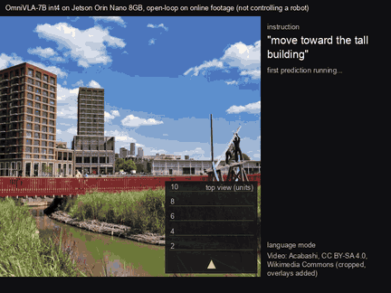

# OmniVLA on a Jetson Orin Nano 8 GB

OmniVLA-7B, a 7B vision-language-action model for robot navigation, running on a Jetson Orin Nano 8 GB at 271 ms per
prediction, with no significant accuracy loss against the original model and better accuracy than OmniVLA-edge.



The deployed runtime on the Jetson itself, at its real rate, on walking footage from Wikimedia Commons; open loop, no
robot ([about the demos](docs/demos.md)).

| | Original OmniVLA-7B (bf16) | This repo (int4, on the Jetson) | OmniVLA-edge |
|---|---|---|---|
| Image goal, driving error (lower is better) | 1.330 | 1.301 (no significant difference, p = 0.17) | 1.490 |
| Object goal, picks the named object | 84% | 82% (no significant difference, p = 0.22) | 70% |
| Weights | 15.1 GB: does not fit (the Orin Nano has 7.6 GB in total) | 4.13 GiB, 1.3 GB of RAM left | 0.43 GB |
| Latency on the Jetson, pose / image / language goal | does not fit | 271 / 775 / 549-564 ms | 113 ms |

Single open-loop predictions on in-distribution test frames, Jetson at MAXN SUPER. The LLM and both vision encoders are
GPTQ int4 on the Marlin kernel; unused goal tokens are dropped and 75% of the camera-image tokens are pruned in pose and
image-goal modes. A ROS 2 node for a small rover is included and has been tested offline on recorded frames; the model
has not driven a rover yet. Details: [Results](#results), [docs/results.md](docs/results.md).

## Quick start

On a Jetson Orin Nano 8 GB with JetPack 6.2, an NVMe SSD, ffmpeg installed and the desktop off:

```
git clone https://github.com/jayden1711/omnivla-jetson.git && cd omnivla-jetson
./deploy/setup_jetson.sh            # venv, OmniVLA clone, 4.1 GB of weights from Hugging Face, bit-exact check
./deploy/launch.sh                  # smoke test: loads the model and prints three pose-goal predictions
./deploy/launch.sh examples/image_goal.py frame.jpg goal.jpg
```

`setup_jetson.sh` asks before every system change and is safe to rerun. Most of its time is the weights download.
Building the weights yourself, the CAST checkpoint, the ROS 2 node and the manual steps: [Setup](#setup).

## Results

Jetson Orin Nano 8 GB (MAXN SUPER), 100 FrodoBots frames per driving test, 210 LeLaN frames for the object-goal test.
Driving errors are in action units (normalized waypoint spacing) against the path the human driver took; lower is
better. Every test has blank-image and shuffled-image controls; of the driving tests, the image-goal test is the one
where they show the model uses the camera (the object-goal test passes its controls too). The deployed config's driving error is not significantly different from bf16 (p = 0.17) or from
bitsandbytes NF4 (p = 0.41), which takes 5x longer per prediction; that comparison, the previous HQQ4 vision path and the
timing of the original 7B on a cloud GPU are in [docs/results.md](docs/results.md).

### 7B or OmniVLA-edge?

OmniVLA also comes as OmniVLA-edge, a small model with the same goal types. Same tests, same frames:

| | OmniVLA-7B int4 (this repo) | OmniVLA-edge |
|---|---|---|
| Image goal, driving error | **1.301** | 1.490 (7B better: +0.19, 95% CI +0.02 to +0.35, p = 0.01) |
| Pose goal 5 s, driving error | **1.177** | 1.387 (7B better: +0.21, CI +0.05 to +0.36, p = 0.003) |
| Pose goal 20 s, driving error [1] | 1.515 | 1.586 (not clearly different: p = 0.03, but the CI includes 0) |
| Object goal ("move toward <object>"), picks the named object | **82%** | 70% (7B better, p = 2e-5) |
| Behavioral instructions (CAST), driving error [1] | 2.231 | 2.188 (no significant difference; neither model trained on them) |
| Latency on the Jetson | 271 ms pose, 775 ms image goal, 549-564 ms language | 113 ms (MAXN SUPER), 132-152 ms (25W) |
| Memory on the Jetson | 4.13 GiB weights, 1.33-1.35 GB RAM left (one mode per process) | 1.10 GB peak GPU memory |

[1] The same int4 weights run on a Kaggle T4 (fp16 kernels) with the previous HQQ4 vision encoders; every other 7B
number is the deployed runtime on the Jetson with the current Marlin vision, which changed neither image-goal nor
object-goal accuracy significantly ([results/vismarlin_summary.md](results/vismarlin_summary.md)). OmniVLA-edge:
accuracy off the Jetson with its 5 past frames; latency and memory measured earlier with OmniVLA's own
`run_omnivla_edge.py` ([results/edge_jetson.md](results/edge_jetson.md)).

**Recommendation:** use the 7B model for image goals where accuracy matters: it is about 13% more accurate there
(p = 0.01), and the image-goal test is the only one where blind controls show the model really uses the camera. It is
also clearly better at object-goal language prompts (82% vs 70%). Use OmniVLA-edge when latency or memory matter more:
it is about 2.4-7x faster (113 ms vs 271-775 ms) and leaves most of the 8 GB free. With a pose goal the 7B is better at
5 s and not clearly better at 20 s, but the pose tests are weaker checks of perception. Full table:
[results/edge_vs_7b.md](results/edge_vs_7b.md); power and energy per prediction:
[results/power_summary.md](results/power_summary.md).

### Language goal

Latency was measured on the Jetson; the accuracy tests below ran on a Kaggle GPU with the same int4 weights (they match
the Jetson to about 0.003 action units), except where a Jetson run is named.

**Object goals, in the format the model was trained on** ("move toward <object>", 210 LeLaN frames with two labeled
objects each; in-distribution): the deployed runtime on the Jetson picks the named object in 82% of frames, bf16 84%
(p = 0.22), OmniVLA-edge 70%. Every model follows the prompt and fails with a blank or shuffled image. The first
language setting scored only 69%; an ablation on the same int4 weights showed that the 75% image-token pruning, not the
int4 weights, caused the whole drop (no pruning 84%, 50% pruning 81%, 75% pruning 69%; fp16 with 75% pruning 71%). So
the runtime skips pruning in language modes (7, 8) and keeps it for pose and image goals, where it did not change driving
error. The price is latency: 549-564 ms per language prediction against 271 ms for a pose goal. Pruning by relevance to
the instruction did not help. Full tables: [docs/results.md](docs/results.md#object-goals-lelan),
[results/lelan_summary.md](results/lelan_summary.md).

**Behavioral instructions (CAST)** ("move along the corridor", 237 episodes): the default checkpoint was not trained on
them, and no model passes the instruction check on this test, so it says nothing about language mode as trained
([results/lang_summary.md](results/lang_summary.md)). For these instructions the OmniVLA authors released
omnivla-finetuned-cast, which `setup_jetson.sh --cast` installs as GPTQ int4. On held-out CAST episodes its int4 error is
1.433 against 1.396 in bf16 (p = 0.35), the turn direction is right in 87% vs 91% (p = 0.29), and a prediction takes
562 ms on the Jetson. Even in bf16 this checkpoint does not pass the shuffled-instruction check here, so treat the test
as a check that quantization kept its behavior, not as proof that it follows instructions
([results/cast_gptq_summary.md](results/cast_gptq_summary.md)). Outside language mode it is not better than the default
weights ([results/cross_mode_summary.md](results/cross_mode_summary.md)).

What was tested on the Jetson and what was not: [docs/validation.md](docs/validation.md).

## Setup

Requirements: Jetson Orin Nano 8 GB with an NVMe SSD, JetPack 6.2 (CUDA 12.6, Python 3.10), booted without the desktop,
with ffmpeg installed (`sudo apt install ffmpeg`, so the correctness check can download its 10 reference frames from
FrodoBots-2K; without it, copy them from a PC as described in `deploy/tests/reference/README.md`). OmniVLA itself is
not included: the setup script clones it at commit `5182600` and applies a one-line patch. Every change made to OmniVLA
is listed in [deploy/CHANGES_TO_OMNIVLA.md](deploy/CHANGES_TO_OMNIVLA.md).

**Weights.** Without `--weights-src`, `setup_jetson.sh` downloads the pre-built weights from
[huggingface.co/jayden1711/omnivla-7b-jetson-int4](https://huggingface.co/jayden1711/omnivla-7b-jetson-int4)
(`--hf-repo` / `--hf-revision` to override) and checks `SHA256SUMS`. The download (4.1 GB) takes most of the setup
time: on the test Jetson the whole README workflow took 15 minutes at about 6.3 MB/s, 11 of them downloading; the rest
(venv with the Jetson torch wheel and a Marlin build, OmniVLA clone, correctness check) took about 4 minutes
([results/readme_rerun_2026-09-29.md](results/readme_rerun_2026-09-29.md)).

**Building the weights yourself** needs a Kaggle account with GPU access, the `kaggle` CLI, ffmpeg and the packages in
`eval/requirements-eval.txt` (the dataset step downloads a few GB of FrodoBots-2K):

```
KAGGLE_USER=<you> ./build/make_build_dataset.sh             # on a PC, once: your private Kaggle dataset (no GPU)
KAGGLE_USER=<you> ./build/build_model.sh build/out          # on a PC: builds the weights on a free Kaggle T4 (~0.4 GPU-h)
./deploy/setup_jetson.sh --weights-src <copy of build/out/weights>   # on the Jetson
```

Both build scripts take `--dry-run`. `python build/verify_build.py build/out/weights` compares a build with the validated
weights tensor by tensor. Weights without the Marlin vision layers (`vis_marpc/`) run with HQQ4 vision, about 103 ms
slower per encoded image; to add them to your own build: `KAGGLE_USER=<you> LANG_TEST=visgptqx eval/kaggle/lang_eval.sh`
(~0.2 GPU-hour), then on the Jetson `CUDA_VISIBLE_DEVICES= python tools/add_vision_marlin.py prequant_vis_gptq.pt
prequant_vis_gptq_manifest.json weights`.

**CAST instructions.** `./deploy/setup_jetson.sh --cast` installs the authors' CAST-fine-tuned checkpoint as int4
([jayden1711/omnivla-7b-cast-jetson-int4](https://huggingface.co/jayden1711/omnivla-7b-cast-jetson-int4)) into
`deploy/weights_cast/` next to the default weights; run it with `OMNIVLA_WEIGHTS=weights_cast deploy/launch.sh`.

**Running.** `deploy/launch.sh` sets the clocks, allocator and page-cache settings the 8 GB Orin needs and runs the
smoke test, a script (`./deploy/launch.sh examples/pose_goal.py ...`) or the ROS 2 node (`--ros`). The manual setup
steps and the rover integration are in [docs/deployment.md](docs/deployment.md);
[docs/troubleshooting.md](docs/troubleshooting.md) covers out-of-memory while loading, NvMap errors, the transformers
fork, the page cache, memory growth and restarts.

## Python API

```python
from omnivla_jetson import OmniVLAJetson

model = OmniVLAJetson("deploy/weights")
p = model.predict(image, goal_image=goal)                                           # image goal
p = model.predict(image, goal_pose=OmniVLAJetson.goal_pose_from_xy_yaw(3.0, 0.0))   # 3 m ahead
p = model.predict(image, instruction="move toward the blue trash bin")             # language (see Results)
p.waypoints          # (8, 4): x, y, cos, sin per step, model units
p.linear, p.angular  # velocity command in m/s and rad/s (OmniVLA's own controller)
```

Images can be PIL images, numpy arrays or file paths. The package wraps `deploy/omnivla_deploy.py` and returns its
outputs unchanged; `tests/test_api.py` checks this by replaying the validated deployment's recorded outputs. Run scripts
through `deploy/launch.sh`. [examples/](examples/) has one script per mode.

## Safety

This is a research deployment, not a safety system. The model sees one camera frame, has no notion of collisions, and
a new prediction arrives only every 0.27 s (pose goal), 0.55 s (language) or 0.8 s (image goal); in between, the rover
executes the last predicted path. Before running it on a robot:

- **Add a depth-based emergency stop that does not depend on the model**: a depth camera, lidar or ultrasonic sensor,
  read by a separate process that publishes `/omnivla_nav/estop` (Bool) when something is inside the stopping distance.
  The node latches neutral on that topic until it is released.
- Keep the speed caps low (the node limits to 0.3 m/s and 0.3 rad/s) and keep a person with a manual kill switch nearby.
- Check the servo channel map on a bench with the wheels off the ground first. It differs between rover hardware versions.
- The node also stops on stale frames (older than 0.5 s), a used-up chunk (2.4 s after its frame) and low memory (below 300 MB).

## Reproducing the results

[eval/README.md](eval/README.md) lists every script: test-frame extraction, the ground-truth builder, the Kaggle
quantization studies and language tests, the OmniVLA-edge comparison, the Jetson latency, accuracy and power runs, the
demo renderers, and the analysis scripts that write [results/](results/). Tests that run anywhere (also in CI):
`python -m unittest discover -s tests`, `deploy/ros2/test_rover_protocol.py` and `deploy/tests/setup_mock_test.sh`.

## Limitations

- All accuracy numbers are open-loop, single predictions. The FrodoBots frames are in-distribution (FrodoBots is in
  OmniVLA's training mix). No closed-loop driving, and the model has not driven a rover.
- Of the driving tests, only the image-goal test passes the blind-model check; the pose-goal tests mostly measure how
  the goal pose is followed.
- Language modes run without image-token pruning to keep object-goal accuracy at the full-precision level (84% vs 69%
  with pruning). They are therefore slower than pose goals (549-564 ms vs 271 ms).
- Process memory grows by 50-65 MB per 10 minutes; restart the node every ~2 hours. Latency differs by up to ~10%
  between boots of the same Jetson (most in language mode), for an unknown reason; compare configurations within one boot.
- Grouped Marlin (groupsize 128) gives wrong results on sm_87; only per-channel weights are used
  ([docs/marlin_sm87_bug.md](docs/marlin_sm87_bug.md)).
- TensorRT vision encoders were tried and are not used: TensorRT 10.3 on the Orin turns the DINOv2 encoder into an
  engine with wrong outputs ([docs/tensorrt_dinov2_issue.md](docs/tensorrt_dinov2_issue.md)).
- The rover's servo channel map differs between hardware versions. Test on a bench with the wheels off the ground first.

## Credit and citation

OmniVLA is by Noriaki Hirose, Catherine Glossop, Dhruv Shah and Sergey Levine
([github.com/NHirose/OmniVLA](https://github.com/NHirose/OmniVLA)). If you use this work, please cite their paper
(and this repo, see [CITATION.cff](CITATION.cff)):

```
@article{hirose2025omnivla,
  title   = {{OmniVLA}: An Omni-Modal Vision-Language-Action Model for Robot Navigation},
  author  = {Hirose, Noriaki and Glossop, Catherine and Shah, Dhruv and Levine, Sergey},
  journal = {arXiv preprint arXiv:2509.19480},
  year    = {2025}
}
```

Changes between versions: [CHANGELOG.md](CHANGELOG.md); release notes: [RELEASE_NOTES.md](RELEASE_NOTES.md).

## License

The code in this repo is MIT ([LICENSE](LICENSE)). OmniVLA is MIT. The model weights are derived from Llama 2 and
fall under the Llama 2 Community License. The FrodoBots-2K data is CC BY-SA 4.0, and so are the demo GIFs and videos in
`docs/media/` (the online-footage demo also contains CC BY 3.0 and CC0 video from Wikimedia Commons). See [THIRD_PARTY_LICENSES.md](THIRD_PARTY_LICENSES.md).
