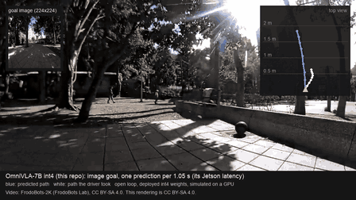

# OmniVLA on a Jetson Orin Nano 8 GB

This repo runs OmniVLA, a 7B vision-language-action model for robot navigation, on a Jetson Orin Nano 8 GB. The LLM is
quantized to int4 with GPTQ and runs on the Marlin kernel. The vision encoders use HQQ 4-bit on GemLite. Unused goal
tokens are dropped and 75% of the camera image tokens are pruned. A ROS 2 node drives a small rover from the model's output.



Image-goal predictions of the deployed int4 weights on three FrodoBots-2K clips that are not in any test set, one per
1.05 s (the image-goal latency on the Jetson). The predictions were computed on a GPU with the same weights (they match
the Jetson to about 0.003 action units). Blue: predicted path. White: the path the human driver took. Open loop: the
model did not drive. Video: FrodoBots-2K by FrodoBots Lab, CC BY-SA 4.0; the GIF and
[docs/media/demo.mp4](docs/media/demo.mp4) are CC BY-SA 4.0 too.

## Results

Jetson Orin Nano 8 GB (MAXN SUPER), 100 FrodoBots frames, image-goal driving test. Errors are in action units
(normalized waypoint spacing); lower is better.

| | This repo | bitsandbytes NF4 | bf16 (cloud GPU) |
|---|---|---|---|
| Latency, pose goal | 424 ms | 1416 ms | - |
| Latency, image goal | 1056 ms (863 ms with an unchanged goal) | 2146 ms | - |
| RAM headroom, pose / image | 1055 / 851 MB | 827 / 575 MB | does not fit |
| Distance from bf16 actions | 0.48 | 0.30 | 0 |
| Driving error vs the human's path | 1.314 | 1.317 | 1.330 |

The driving error of this repo's config is not significantly different from NF4 (p = 0.76) or bf16 (p = 0.40). Details:
[results/gptq_validation.md](results/gptq_validation.md), [results/final_validation.md](results/final_validation.md),
[results/](results/).

### 7B or OmniVLA-edge?

OmniVLA also comes as OmniVLA-edge, a small model with the same goal types. Same tests, same frames:

| | OmniVLA-7B int4 (this repo) | OmniVLA-edge |
|---|---|---|
| Image goal, driving error | **1.314** | 1.490 (7B better: +0.18, 95% CI +0.01 to +0.34, p = 0.01) |
| Pose goal 5 s, driving error | **1.220** | 1.387 (7B better: +0.17, CI +0.02 to +0.31, p = 0.01) |
| Pose goal 20 s, driving error | 1.515 | 1.586 (not clearly different: p = 0.03, but the CI includes 0) |
| Object goal ("move toward <object>"), picks the named object | **84%** (language modes run without token pruning) | 70% (7B better, p = 1e-6) |
| Behavioral instructions (CAST), driving error | 2.231 | 2.188 (no significant difference; neither model trained on them) |
| Latency on the Jetson | 424 ms pose, 1056 ms image goal, about 750 ms language (estimated, pending) | 113 ms (MAXN SUPER), 132-152 ms (25W) |
| Memory on the Jetson | 4.14 GiB weights, 0.85-1.06 GB RAM left | 1.10 GB peak GPU memory |

Image goal and 5 s pose goal: the deployed runtime's outputs on the Jetson. 20 s pose goal and language: the same int4
weights on a Kaggle T4 (fp16 kernels; they match the Jetson to 0.003 action units where both exist). OmniVLA-edge:
accuracy off the Jetson with its 5 past frames; its latency and memory were measured earlier with OmniVLA's own
`run_omnivla_edge.py`, not with this repo ([results/edge_jetson.md](results/edge_jetson.md)).

**Recommendation:** use the 7B model for image goals where accuracy matters: it is about 12% more accurate there
(p = 0.01), and the image-goal test is the only one where blind controls show the model really uses the camera. It is
also clearly better at object-goal language prompts (84% vs 70%). Use OmniVLA-edge when latency or memory matter more:
it is about 4-9x faster (113 ms vs 424-1056 ms) and leaves most of the 8 GB free.

- With a pose goal the 7B is better at 5 s and not clearly better at 20 s, but the pose tests are weaker checks of
  perception: a shuffled camera image does not make the 7B model clearly worse on them.
- With a language goal, the 7B only keeps its edge because language modes skip the image-token pruning: with the
  75% pruning used for pose and image goals it drops to 69%, level with edge; see below.

Full table: [results/edge_vs_7b.md](results/edge_vs_7b.md). Power is not measured yet.

### Language goal

Two tests, both with blank-image, shuffled-image and shuffled-instruction controls. Language mode has not been run on
the Jetson; the int4 numbers are the deployed weights on a Kaggle T4 (fp16 kernels, which match the Jetson to about
0.003 action units on the image-goal test).

**Object goals, in the format the model was trained on** ([results/lelan_summary.md](results/lelan_summary.md)). 210
frames from LeLaN's robot recordings, each with two labeled objects in different directions; the prompt is
"move toward <object>" for one of them. This is in-distribution: LeLaN is in the checkpoint's training mix, so it checks
that language mode works as trained, not that it generalizes.

| | Picks the named object | With the other object's prompt |
|---|---|---|
| | Picks the named object | With the other object's prompt |
|---|---|---|
| 7B full precision (bf16; the control run in fp16) | 84% | 19% |
| **7B int4, no image-token pruning (language modes now)** | **84%** | 20% |
| 7B int4, 50% pruning | 81% | 25% |
| 7B int4, 75% pruning (the first language setting) | 69% | 31% |
| 7B fp16, 75% pruning, no quantization | 71% | 28% |
| OmniVLA-edge | 70% | 29% |
| Straight ahead (no model) | 48% | |

Every model follows the prompt and fails with a blank or shuffled image, so they use both. The first run of the
deployed config (69%) was clearly below full precision; the ablation above, on the same int4 weights, shows why: **the
75% image-token pruning causes the whole drop, not the int4 weights.** Without pruning the int4 weights match bf16
(84%, p = 1); 50% pruning costs 3 points (not significant); 75% pruning costs about the same with or without
quantization. So the runtime and the Python API now skip pruning in language modes (7, 8), and keep 75% for pose and
image goals, where it did not change driving error. The price is latency: about 750 ms instead of about 430 ms per
language prediction, estimated from pose-mode measurements without pruning (754 ms) and not yet measured in language
mode. `lang_prune_frac=0.5` is a middle ground (81%).

Language grounding turned out to be more sensitive to compression than pose and image goals: the pruning that left
their driving error unchanged cost 15 points here. Each goal type needs its own task-grounded test.

**Behavioral instructions (CAST)** ([results/lang_summary.md](results/lang_summary.md)). 237 episodes with instructions
like "move along the corridor". The deployed checkpoint was not trained on this kind of instruction; the OmniVLA authors
released a separate checkpoint, omnivla-finetuned-cast, for it, which this repo does not use. As expected, no model
passes the instruction check here: a shuffled instruction is not worse than the right one. So this test says nothing
about language mode as trained, and the int4-vs-bf16 difference on it (-0.26, p = 0.046) does not mean int4 is better.

## Tested on real hardware, and what is not

On the Jetson Orin Nano 8 GB (JetPack 6.2):
- Loading, latency and memory of the deployed runtime, pose goal and image goal (100 frames each).
- Bit-exact reproduction of the validated outputs (`deploy/tools/reference_check.py`, 10 frames x 2 modes).
- 30-minute soaks in pose and image-goal mode: no slowdown, no throttling, slow memory growth ([deploy/SOAK.md](deploy/SOAK.md)).
- The manual setup steps in [docs/deployment.md](docs/deployment.md), in a fresh venv and a fresh OmniVLA clone.
- The ROS 2 node in offline replay (recorded camera frames, no rover), including fault injection.

Not tested on hardware yet:
- The rover: the model has never driven it. The servo bridge has not run on the rover's Pi.
- Any closed-loop driving. All accuracy numbers are open-loop single predictions.
- `deploy/setup_jetson.sh` end to end on a Jetson (only its mock test; `build/jetson_e2e_test.sh` is ready).
- Language modes (7 and 8), including their latency without pruning, and the `omnivla_jetson` package (its check,
  `deploy/tools/api_check.py`, is ready).
- The mode-dependent pruning in `deploy/omnivla_deploy.py`: pose and image-goal modes use the same code path and
  pruning as before, so `deploy/tools/reference_check.py` should still match bit for bit, but it has not been rerun.
- Power and energy per inference (`eval/jetson/run_power_sweep.sh` is ready).

## Requirements

- Jetson Orin Nano 8 GB with an NVMe SSD, JetPack 6.2 (CUDA 12.6, Python 3.10), booted without the desktop.
- To build the weights: a Kaggle account with GPU access, the `kaggle` CLI, ffmpeg and the packages in
  `eval/requirements-eval.txt` (the dataset step downloads a few GB of FrodoBots-2K). Not needed if you use the pre-built
  weights on Hugging Face: [huggingface.co/jayden1711/omnivla-7b-jetson-int4](https://huggingface.co/jayden1711/omnivla-7b-jetson-int4).
- ffmpeg on the Jetson for the one-time reference-image download (or copy the images from a PC).
- OmniVLA itself is not included. The setup script clones it at commit `5182600` and applies a one-line patch.

## Setup

Skip the first two commands if you use the pre-built weights: without `--weights-src`, `setup_jetson.sh` downloads
them from Hugging Face (`--hf-repo` / `--hf-revision` to override) and checks `SHA256SUMS`.

```
KAGGLE_USER=<you> ./build/make_build_dataset.sh             # on a PC, once: your private Kaggle dataset (no GPU)
KAGGLE_USER=<you> ./build/build_model.sh build/out          # on a PC: builds the weights on a free Kaggle T4 (~0.4 GPU-h)
./deploy/setup_jetson.sh --weights-src <copy of build/out/weights>   # on the Jetson
```

Both build scripts take `--dry-run`. `python build/verify_build.py build/out/weights` compares a build with the validated
weights tensor by tensor. `setup_jetson.sh` asks before every system change (power mode, headless boot, swap, sudoers entries), builds the venv
with the Jetson PyTorch wheel, and ends with a check that 10 reference frames (downloaded from FrodoBots-2K on first use) reproduce the validated
outputs bit for bit.
It is safe to rerun. Run the model with `deploy/launch.sh`; the ROS 2 node with `deploy/launch.sh --ros`.
See [docs/deployment.md](docs/deployment.md) for the manual steps and the rover setup, and
[docs/troubleshooting.md](docs/troubleshooting.md) if something fails (out of memory while loading, NvMap errors, the
transformers fork, the page cache, memory growth and restarts).
Every change made to OmniVLA is listed in [deploy/CHANGES_TO_OMNIVLA.md](deploy/CHANGES_TO_OMNIVLA.md).

## Python API

```python
from omnivla_jetson import OmniVLAJetson

model = OmniVLAJetson("deploy/weights")
p = model.predict(image, goal_image=goal)                                           # image goal
p = model.predict(image, goal_pose=OmniVLAJetson.goal_pose_from_xy_yaw(3.0, 0.0))   # 3 m ahead
p = model.predict(image, instruction="move toward the blue trash bin")             # language (see Results)
p.waypoints          # (8, 4): x, y, cos, sin per step, model units
p.linear, p.angular  # velocity command in m/s and rad/s (OmniVLA's own controller)
```

Images can be PIL images, numpy arrays or file paths. The package wraps `deploy/omnivla_deploy.py` and returns its
outputs unchanged. `tests/test_api.py` checks this by replaying the validated deployment's recorded outputs. Run scripts
through `deploy/launch.sh`, which sets the clocks, allocator and page-cache settings the 8 GB Orin needs:
`./deploy/launch.sh examples/image_goal.py frame.jpg goal.jpg`. [examples/](examples/) has one script per mode.

## Safety

This is a research deployment, not a safety system. The model sees one camera frame, has no notion of collisions, and
a new prediction arrives only every 0.4 s (pose goal) to 1 s (image goal); in between, the rover executes the last
predicted path. Before running it on a robot:

- **Add a depth-based emergency stop that does not depend on the model**: a depth camera, lidar or ultrasonic sensor,
  read by a separate process that publishes `/omnivla_nav/estop` (Bool) when something is inside the stopping distance.
  The node latches neutral on that topic until it is released.
- Keep the speed caps low (the node limits to 0.3 m/s and 0.3 rad/s) and keep a person with a manual kill switch nearby.
- Check the servo channel map on a bench with the wheels off the ground first. It differs between rover hardware versions.
- The node also stops on stale frames (older than 0.5 s), a used-up chunk (2.4 s after its frame) and low memory (below 300 MB).

## Reproducing the results

[eval/README.md](eval/README.md) lists the scripts: test-frame extraction from FrodoBots-2K, the ground-truth builder,
the Kaggle quantization studies, the language test (`eval/kaggle/lang_eval.sh`, ~1 GPU-hour), the OmniVLA-edge
comparison, the Jetson latency, accuracy and power runs, the demo renderer, and the analysis scripts that write `results/`.
The ROS tests are `deploy/ros2/run_ros_test.sh` (offline replay, no rover) and `deploy/fault_injection/run_faults.sh`.
Tests that run anywhere (also in CI): `python -m unittest discover -s tests`, `deploy/ros2/test_rover_protocol.py` and
`deploy/tests/setup_mock_test.sh`.

## Limitations

- All accuracy numbers are open-loop, single predictions. The FrodoBots frames are in-distribution (FrodoBots is in
  OmniVLA's training mix). No closed-loop driving yet.
- Only pose-goal and image-goal modes were validated on the Jetson, and only the image-goal test passes the blind-model
  check.
- Language modes run without image-token pruning to keep object-goal accuracy at the full-precision level (84% vs 69%
  with pruning, [results/lelan_summary.md](results/lelan_summary.md)). They are therefore slower than pose goals
  (about 750 ms, estimated; not measured on the Jetson yet).
- Process memory grows by 50-65 MB per 10 minutes; restart the node every ~2 hours.
- Grouped Marlin (groupsize 128) gives wrong results on sm_87; only per-channel weights are used
  ([docs/marlin_sm87_bug.md](docs/marlin_sm87_bug.md)).
- The rover's servo channel map differs between hardware versions. Test on a bench with the wheels off the ground first.

## Credit and citation

OmniVLA is by Noriaki Hirose, Catherine Glossop, Dhruv Shah and Sergey Levine
([github.com/NHirose/OmniVLA](https://github.com/NHirose/OmniVLA)). If you use this work, please cite their paper
(and this repo, see [CITATION.cff](CITATION.cff)):

```
@article{hirose2025omnivla,
  title   = {{OmniVLA}: An Omni-Modal Vision-Language-Action Model for Robot Navigation},
  author  = {Hirose, Noriaki and Glossop, Catherine and Shah, Dhruv and Levine, Sergey},
  journal = {arXiv preprint arXiv:2509.19480},
  year    = {2025}
}
```

Changes between versions: [CHANGELOG.md](CHANGELOG.md).

## License

The code in this repo is MIT ([LICENSE](LICENSE)). OmniVLA is MIT. The model weights are derived from Llama 2 and
fall under the Llama 2 Community License. The FrodoBots-2K data is CC BY-SA 4.0, and so are the demo GIF and video in
`docs/media/`. See [THIRD_PARTY_LICENSES.md](THIRD_PARTY_LICENSES.md).
